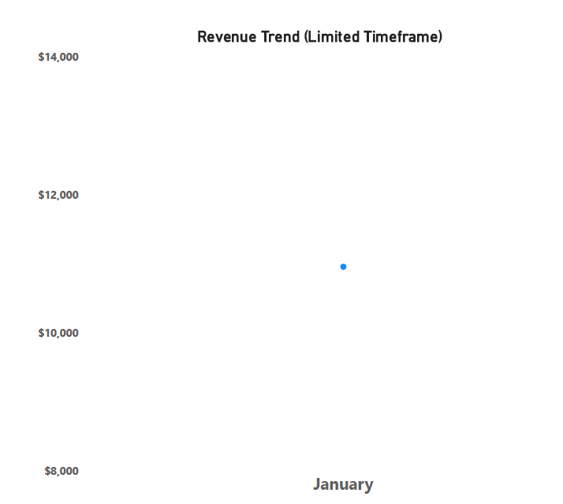
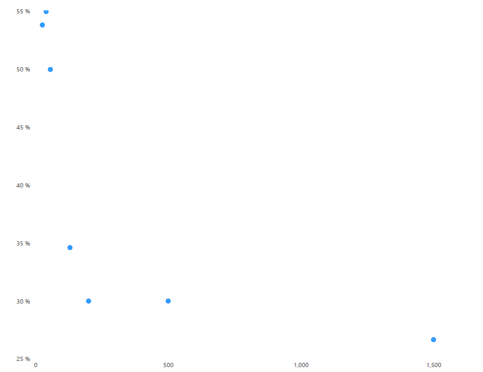

# E-commerce Inventory Intelligence 📊

## 📋 Project Overview
This project analyzes sales performance and profit margins for an e-commerce inventory. The goal is to identify top-performing products and validate financial data integrity.

## 🛠️ Tech Stack
* **Python (Pandas)**: Data cleaning and analysis.
* **Jupyter Notebook**: Interactive workflow documentation.
* **SQL**: Result validation from the database.
* **Git/GitHub**: Version control.

## 🚀 Key Insights
* **Total Revenue**: $10,955.49 USD
* **Global Margin**: 12.14%
* **Top-Selling Product**: Gaming Laptop 💻
## 📊 Data Visualization
Below are the visual representations of the inventory analysis:

### Sales Overview

### Performance Trends

### Detailed Inventory Analysis

## 📁 Repository Structure
* `analysis_workflow.ipynb`: Main notebook with sales analysis.
* `orders_dataset.csv`: Source data.
* `sql_queries/`: Validation scripts.
## 💡 Why This Project?
As an independent hardware reseller specializing in **Gamer and Workstation laptops**, I developed this analysis to bridge the gap between sales operations and data-driven inventory management. My background in high-performance hardware helps me interpret these metrics with a focus on market value and technical specifications.