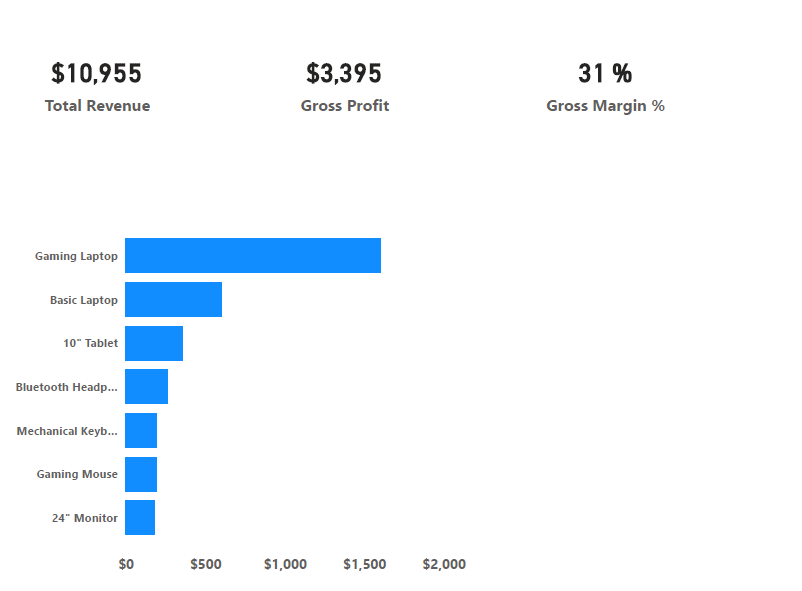

# 💻 E-commerce Inventory Intelligence: Laptop Stock Optimization

## 📌 Professional Context
**Bridging 8 years of Tech Retail expertise with Data Analytics.** 
After nearly a decade managing technology sales and inventory on the floor, I am now automating the business logic I used daily. [cite: 2025-10-21] This project transforms raw e-commerce data into actionable insights for stock management and profitability. 

## 📊 Executive Dashboard Preview
*Visualizing the pulse of the business.* 

 
*(Note: Replace with your actual image filename if different)* 

### Key Insights:
- **Revenue Performance**: Achieved a total revenue of **$10,955** across key laptop models.
- **Profitability**: Maintained a **31% Gross Margin** by optimizing cost structures.
- **Inventory Health**: Real-time tracking of **Critical Stock** levels to prevent stockouts (Lead Time: 7 days).

## 🛠️ Tech Stack & Methodology
- **Python (Pandas)**: Core engine for KPI calculation and data cleaning.
- **SQL**: Used for data validation and cross-checking metrics against Python outputs. 
- **Power BI**: Advanced visualization and executive reporting. 

## 🚀 How to Run
1. **Clone the repository**:
   `git clone https://github.com/batizia2-ui/E-commerce-Inventory-Intelligence.git`
2. **Install dependencies**:
   `pip install pandas`
3. **Execute Analysis**:
   - Run `python kpi_profit_margin_analysis.py` for margin reports.
   - Run `python kpi_critical_stock.py` for inventory alerts.

## 🔍 Data Validation (SQL)
*I use SQL to ensure data integrity. Example queries can be found in the `/sql_queries` folder.* 